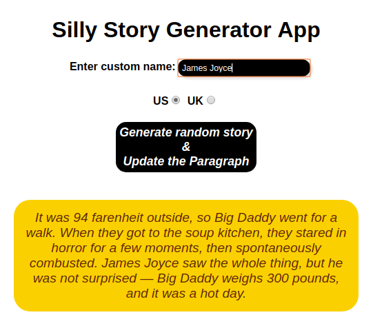

# Silly Story Generator

## This project if part of the [Gomycode](https://gomycode.tn) Fullstack JS cursus.

## User Stories

1. <strong>User story:</strong> The user can generate random stories by clickin on the random silly generator button.

2. <strong>User story:</strong> The user can enter a random name in the input 

    

# What did I learn:

1. DOM manipulation.

2. Vanilla JS.
